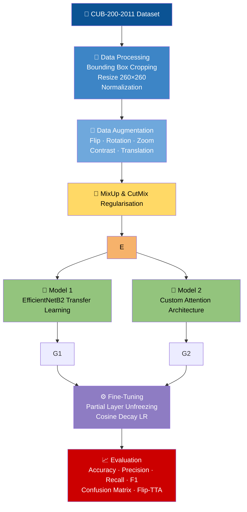

# Fine-Grained Bird Species Classification using EfficientNet & Custom Deep Learning Architectures  
### Transfer Learning · Fine-Tuning · Attention Mechanisms · Test-Time Augmentation

[](https://python.org)
[](https://tensorflow.org)
[](https://keras.io)
[](https://scikit-learn.org)
[](LICENSE)

---

# Overview

This project focuses on **fine-grained bird species classification** using the **CUB-200-2011 dataset**, containing **200 visually similar bird species**.

The challenge is difficult because many bird classes have:
- Nearly identical colors and textures
- Similar body structures
- Small inter-class visual differences
- Variations in lighting, pose, background, and occlusion

To solve this problem, two deep learning approaches were developed:

| Model | Description |
|---|---|
| **Model 1** | EfficientNetB2 transfer learning with fine-tuning |
| **Model 2** | Custom attention-enhanced architecture built on top of EfficientNet backbone |

The project combines:
- Transfer learning
- Fine-tuning
- Bounding-box based preprocessing
- MixUp & CutMix regularisation
- Attention mechanisms
- Cosine decay learning rate scheduling
- Flip Test-Time Augmentation (TTA)

---

# Final Results

## Model 1 — EfficientNetB2 Fine-Tuned

| Metric | Validation | Test |
|---|---|---|
| Accuracy | **81.8%** | **80.9%** |
| Precision (Macro) | 0.85 | 0.82 |
| Recall (Macro) | 0.82 | 0.81 |
| F1 Score (Macro) | 0.81 | 0.81 |

---

## Model 2 — Custom Attention-Based Architecture

| Metric | Validation | Test |
|---|---|---|
| Accuracy | **80.33%** | **79.60%** |
| Precision (Macro) | 0.844 | 0.808 |
| Recall (Macro) | 0.803 | 0.798 |
| F1 Score (Macro) | 0.799 | 0.797 |

---

# Confusion Matrices

## EfficientNetB2 Fine-Tuned Model


---

## Custom Attention-Based Model


---

# Why EfficientNet?

EfficientNet was selected because it provides an excellent balance between:
- Accuracy
- Computational efficiency
- Parameter efficiency

Compared with traditional CNNs, EfficientNet:
- Uses compound scaling to balance network depth, width, and resolution
- Achieves strong ImageNet performance with fewer parameters
- Transfers extremely well to fine-grained classification tasks

This makes it ideal for:
- Small-to-medium datasets
- Fine-grained recognition problems
- Transfer learning applications

---

# 🔬 Key Technical Highlights

## Bounding Box Cropping
Used official bird bounding boxes to remove unnecessary background information and force the model to focus on the bird itself.

## Transfer Learning
Used ImageNet-pretrained EfficientNet weights to leverage learned visual features such as:
- edges
- textures
- patterns
- shapes

## Fine-Tuning
Unfroze later EfficientNet layers to adapt pretrained features specifically to bird species classification.

## MixUp & CutMix Regularisation
Improved generalisation and reduced overfitting by creating synthetic training samples.

## Attention Mechanism (Model 2)
Implemented a custom channel-attention gate to help the network focus more strongly on important feature channels.

## Test-Time Augmentation (TTA)
Predictions from original and horizontally flipped images were averaged for more robust inference.

## Cosine Decay Learning Rate
Used smooth learning-rate reduction during fine-tuning for stable convergence.

---

# Project Pipeline



---

# Model Architectures

## Model 1 — EfficientNetB2 Transfer Learning

### Architecture
- EfficientNetB2 backbone pretrained on ImageNet
- Global Average Pooling
- Dropout (0.30)
- Dense Softmax Classifier

### Training Strategy

#### Phase 1
- Backbone frozen
- Train classification head only

#### Phase 2
- Unfreeze last 40 layers
- Fine-tune using very small learning rate

---

## Model 2 — Custom Attention-Based Architecture

### Architecture
- EfficientNetB0 pretrained backbone
- Custom channel-attention gate
- Batch normalization
- Multi-layer custom classification head
- Dense hidden representation layer
- Dropout regularisation

### Advanced Regularisation
- MixUp
- CutMix
- Label smoothing
- Flip-TTA

---

# Repository Structure

```text
fine-grained-bird-classification/
│
├── README.md
├── requirements.txt
├── LICENSE
│
├── notebook/
│   ├── Bird_Classification_DL.ipynb
│
├── pipeline/
│   ├── data_pipeline.py
│   ├── model1.py
│   └── model2.py
│
├── Results/
│   ├── Confusion_matrix_EfficientNetB2.png
│   ├── Confusion_matrix_Custom CNN.png
│   └── test_predictions_with_names.csv
│   └── test_confusion_matrix.npy
│   └── final_test_metrics.txt

```

---

# Installation

```bash
git clone https://github.com/YOUR_USERNAME/fine-grained-bird-classification.git

cd fine-grained-bird-classification

pip install -r requirements.txt
```

---

# How to Run

## Model 1 — EfficientNetB2

Run notebook cells in the following order:

1. Load CUB-200-2011 Dataset
2. Load metadata and bounding boxes
3. Stratified Train/Validation Split
4. TensorFlow data pipeline
5. Data augmentation
6. MixUp regularisation
7. Build EfficientNetB2 model
8. Train classification head
9. Fine-tune last 40 layers
10. Evaluate with Flip-TTA
11. Generate confusion matrix
12. Save checkpoints and predictions

### Best checkpoint

```text
/content/drive/MyDrive/cub_models/efficientnetb2_final.keras
```

---

## Model 2 — Custom Attention Architecture

Run notebook cells in the following order:

1. Load dataset and metadata
2. Bounding-box preprocessing
3. TensorFlow data pipeline
4. One-hot label preparation
5. MixUp + CutMix augmentation
6. Build custom architecture
7. Train custom classification head
8. Fine-tune EfficientNet backbone
9. Apply cosine decay learning rate
10. Evaluate using Flip-TTA
11. Generate confusion matrix
12. Save predictions and checkpoints

### Best checkpoint

```text
/content/checkpoints/model2_custom_finetuned_best.keras
```

---

# Demo Features

The demo pipeline supports:
- Folder-based evaluation
- Automatic prediction generation
- Per-image CSV export
- Confusion matrix plotting
- Flip Test-Time Augmentation

---

# Tech Stack

| Category | Tools |
|---|---|
| Deep Learning | TensorFlow, Keras |
| Machine Learning | Scikit-learn |
| Data Processing | NumPy, Pandas |
| Visualisation | Matplotlib |
| Training Environment | Google Colab |
| Dataset | CUB-200-2011 |

---

# Research Inspiration

This project was inspired by transfer learning and fine-grained visual recognition research including:

- EfficientNet: Rethinking Model Scaling for CNNs
- MixUp: Beyond Empirical Risk Minimization
- CutMix: Regularization Strategy to Train Strong Classifiers
- Squeeze-and-Excitation Networks

---

# License

This project is licensed under the MIT License.

---

# Author

AJ  
MSc Artificial Intelligence / Data Science & AI Student  
Deep Learning · Computer Vision · Machine Learning
